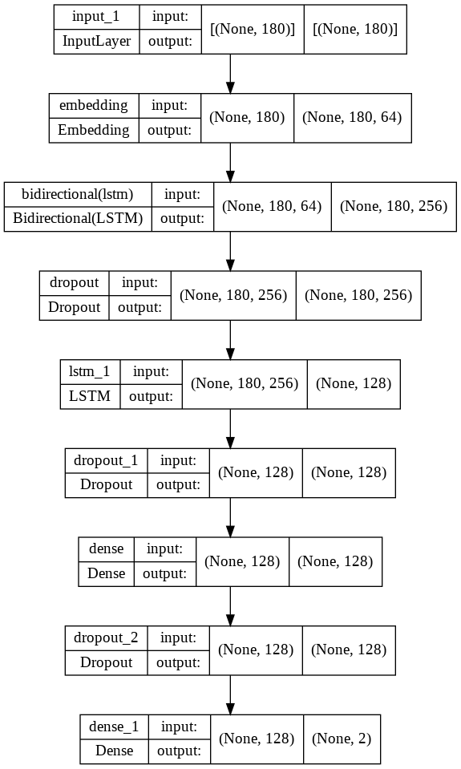

  
  
  
 
 
# Sentiment Analysis on Movie Reviews using Deep Learning

### Descriptions
1) The objectives of this project is to develop customer model reviews either it is positive or negative feedbacks
2) Trained with over 60,000 IMDB dataset to categorize positive and negative reviews.
3) Contains 50,000 reviews and 50,000 sentiments
4) Trained with 10 epochs
5) Data contains anomalies such as HTML tags, unnecessary characters and combination of uppercase and lowercase alphabets
6) By using RegEx to remove the anamolies: remove HTML tags and unnecessary character and convert all alphabets into lowercase
7) Methods used: `Word Embedding`,`LSTM`,`Bidirectional`

### Results
`Model`

`Classification_Report`

`Confusion_Matrix`

`Training Data`

### Discussion
*Suggestions to Improve the Performance of Model*
1) Apply `Early Stopping` to prevent overfitting
2) Increase `Droput rate` to control overfitting
3) Approach with different architecture such as: `BERT Model`,`Transformer Model`,`GPT3`

### Credits
`You can load the dataset from here`
https://raw.githubusercontent.com/Ankit152/IMDB-sentiment-analysis/master/IMDB-Dataset.csv

